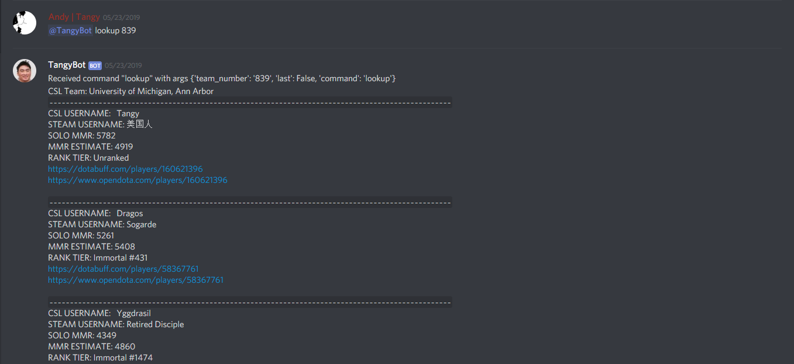
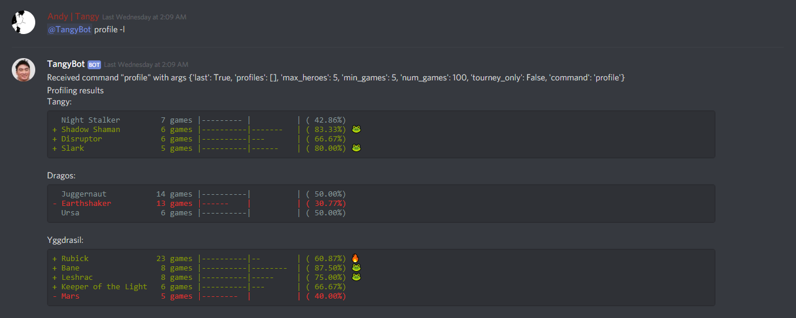
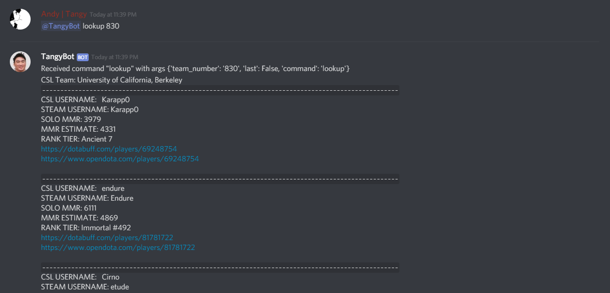
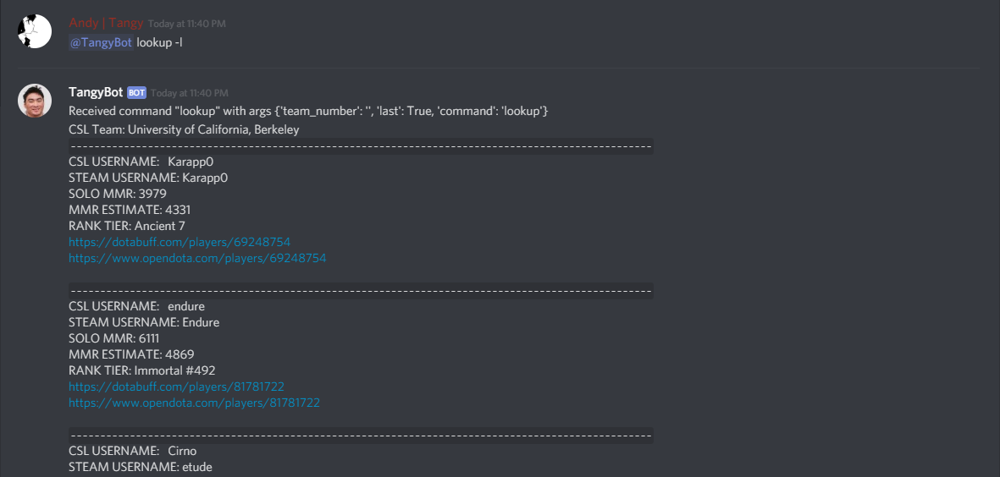
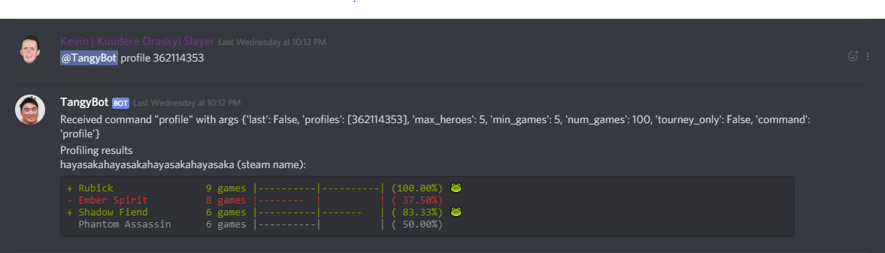
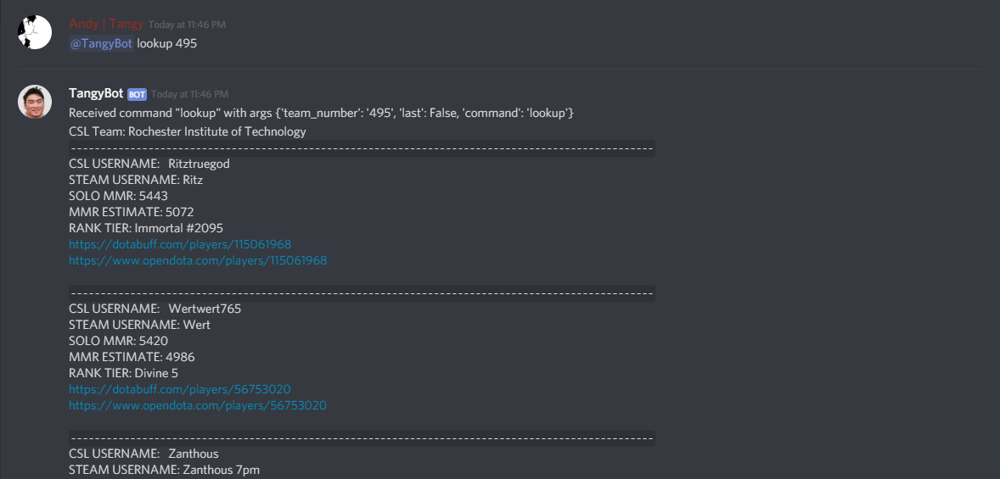
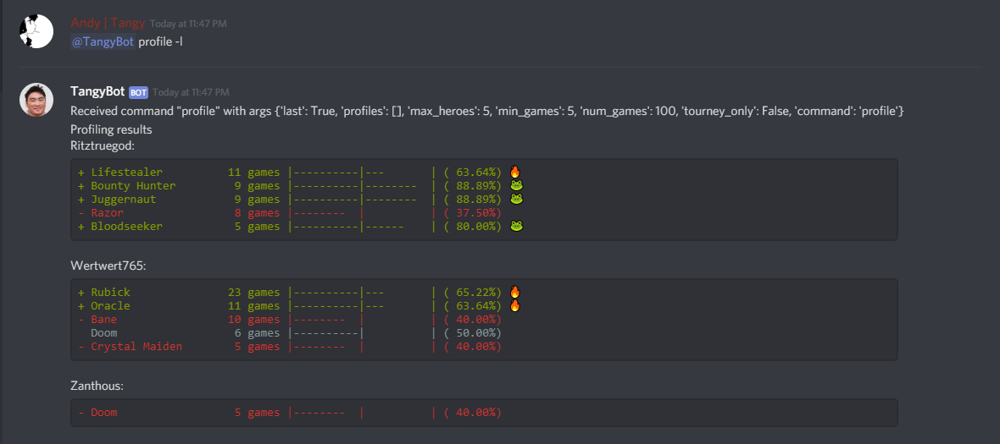
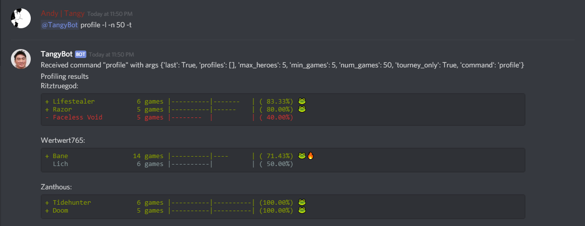

# CSLTL (TangyBot)

A bot that looks up teams and players for Collegiate Starleague Dota2 and provides draft information.

TangyBot is currently deployed for Discord and was previously deployed for Slack.

## TangyBot Examples





Additional examples and explanations can be found at the end of this page.

## Getting Started with Your Own Bot

These instructions will help you get a copy of this project on your local machine. You will need the following minimum prerequisites:

* A steam API key.

If you desire additional functionality, you will need additional prerequisites. These are defined in each of the respective sections below:

### Setting up Basic Functionality

1. Clone this repository.
2. Install the requirements. Run `pip install -r requirements.txt` in a virtual environment.
3. Set your steam key as an environment variable. In bash, this can be done with `export STEAM_KEY=YOUR_KEY_HERE`, and in anaconda for windows you can use `set STEAM_KEY=YOUR_KEY_HERE`.
4. TangyBot can be directly invoked from the command line, via `python cli.py [args]`. Try a basic query like `python cli.py lookup 839` to look up the University of Michigan.

### Running in Discord

If you wish to run TangyBot in a Discord server, you will need the following:

* A Discord client ID.
* A Discord bot token.

1. Set the environment variables for the bot's token and client id. Similar to above, this is done via `export DISCORD_CLIENT_ID=YOUR_BOT_ID` and `export DISCORD_TOKEN=YOUR_BOT_TOKEN`.
2. Test the bot by running `python discord_bot.py file`. You should see the bot reply with `TangyBot Start` and you should be able to invoke TangyBot in Discord. Test it out by typing (in a channel the bot can access) `@TangyBot lookup 839` to try and look up the University of Michigan again.

### Using AWS Backend

One feature of Heroku is its ephemeral filesystem, which means that any changes to files are erased upon restarting dynos. This does not play well with the information that Tangy Bot wants to cache, so if you are deploying to an ephemeral filesystem, you may want to use the AWS backend instead of the standard file backend.

We decided to use AWS' DynamoDB due to being free forever (as far as we are aware) for smaller workloads, while still being reliable. Thus, you will need the following for using the AWS backend:

* An AWS Access Key.
* An AWS Secret Access Key.

The default region is hardcoded as us-east-2 for the moment, since it seems difficult to specify within Heroku.

1. [Configure AWS](https://docs.aws.amazon.com/cli/latest/userguide/cli-chap-configure.html) on your computer.
2. Set up DynamoDB tables. Specifically, TangyBot is looking for tables named `TangyBot_Session` and `TangyBot_Profile`.
3. When launching the Discord bot, do so via `python discord_bot.py aws`. `cli.py` currently does not support the backend.

## Contributing

Create a pull request. Formatting is not really strict PEP8, but try to follow the general ideas.

### Creating a New Command

If you want to create a new command in TangyBot that is invoked in the format `@TangyBot command [args]` you will need to modify the following files:

* **cli.py**: Add support for the new command inside TangyBotArgParse, i.e. `self.subparses.add_parser()` then configure it appropriately as you would any other argument parser.
* **backend.py**: Create a new function with the following signature inside TangyBotBackend: `async def command_name(self, your_kwargs, that_you_want, username="user", **_)`. The kwargs that you want should be the same as those that you have defined inside cli.py; `username` is the user that is making the request, and the additional `**_` is required to ensure that no unexpected kwargs (such as `command`) are received and python doesn't complain.
* **frontend.py**: Create a new function with the following signature inside FrontendFormatter: `def command_name(self, backend_kwargs, that_you_want):` where the arguments are those that you have returned from the backend. For example, if your backend command returned a dict in the format `{name: ...}` you would use `name` as the argument.

## Additional Examples and Explanations

Some practical examples for reference. **This does not cover all of the features TangyBot has to offer. Complete details can be found in [cli.py](https://github.com/boboququ/CSLTL/blob/master/cli.py).**

### lookup

Functionality for looking up CSL teams.

```
lookup ([--last] | <team_number>)
```



TangyBot remembers the last lookup a user has made. Using the [--last] argument instead of <team_number> will return the last lookup the user made.



### profile

Functionality for looking up individual players through their steam profiles.

```
profile ([--last] | [user_1, user_2, ...]) [--num_games (100)]
        [--max_heroes (5)] [--min_games (5)] [--tourney_only]
```



Gathering the steam IDs of each player would be a hassle. Luckily, TangyBot does this for you. Using the [--last] command after a team lookup will return the profiles of each player on that team.





You may also filter the results if you specify parameters. For instance, using the [--num_games] parameter will return results based on the player's most recent number of games. Using the [--tourney_only] flag will filter the results so that they only return the player's lobby games.



The full list of options may be found in [cli.py](https://github.com/boboququ/CSLTL/blob/master/cli.py).

## Contributors

See also the complete list of [contributors](https://github.com/boboququ/CSLTL/graphs/contributors) who have participated in this project.

